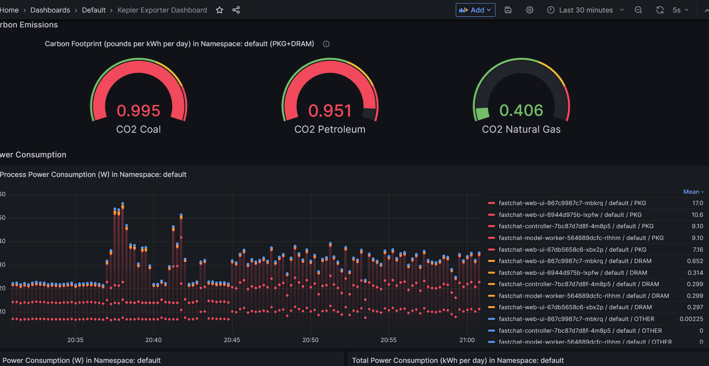
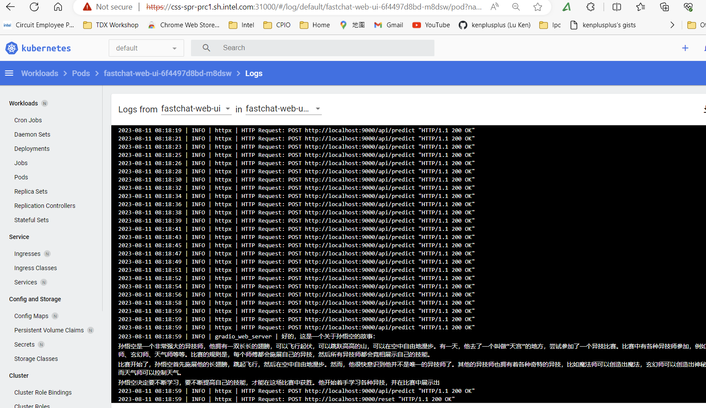

# Cloud Native AI-Generated Content (CNAGC)

This project is to bring AIGC to Kubernetes via cloud native stateless design.

## 1. Download Models

The pre-trained models were at http://css-devops.sh.intel.com/download/aigc/models/

- To download  model:

```
./models/get_models.sh opt-1.3b-bf16-8b-samples
```

- To download all models:

```
./models/get_models.sh all
```

## 2. Getting Start to Run in Container

1. Build container `gar-registry.caas.intel.com/cpio/cnagc-fastchat`

```
./container-build.sh -c cnagc-fastchat
```

There are following tags, the default one is `2.0.100-cpu`

| | llm-cpu | v2.0.100-cpu | v2.0.110-xpu |
| -- | -- | -- | -- |
| tag | [v2.1.0.dev+cpu.llm](https://github.com/intel/intel-extension-for-pytorch/tree/v2.1.0.dev+cpu.llm) | [v2.0.100+cpu](https://github.com/intel/intel-extension-for-pytorch/releases/tag/v2.0.100%2Bcpu) | [v2.0.110+xpu](https://github.com/intel/intel-extension-for-pytorch/tree/v2.0.110+xpu) |
| Accelerator | CPU | CPU | GPU/CPU |
| Stable | No | Good | Good |
| AMX work | No | Work | ? |
| Size | 3G | 5G | 26 G|
| OneAPI base | No | No | Yes |
| CPIO Registry | Yes | Yes | No, too big|

To use them please:
```
docker pull gar-registry.caas.intel.com/cpio/cnagc-fastchat:v2.0.100-cpu
docker pull gar-registry.caas.intel.com/cpio/cnagc-fastchat:v2.0.110-xpu
```

2. Run cloud native AIGC container with given model

```
./docker-runchat.sh -m models/vicuna-7b-v1.3
```

3. Use different ISA

- use AVX512

```
./docker-runchat.sh -m models/vicuna-7b-v1.3 -i avx512
```

- use AMX

```
./docker-runchat.sh -m models/vicuna-7b-v1.3 -i amx
```


## 3. Getting Start to Run on Kubernetes


### 3.1 Build container `gar-registry.caas.intel.com/cpio/cnagc-fastchat`


```
./container-build.sh -c cnagc-fastchat-k8s
```

There are following tags, the default one is `2.0.100-cpu`

### 3.2 Deploy

```
cd deployment
kubectl apply -k kustomization.yaml
```

## 4. Demo





