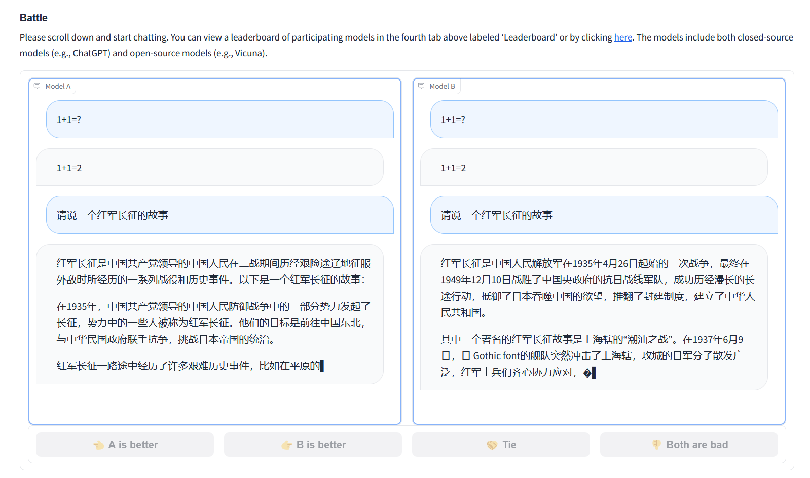

# Cloud Native AI-Generated Content (CNAGC)

This project is to bring AIGC to Kubernetes via cloud native stateless design.

## 1. Download Models

You can download model from huggingface.

- BF16 model for AMX optimization

    ```shell
    # Llama-2-7b-chat-hf-sharded-bf16
    cd models
    git lfs install
    git clone https://huggingface.co/Trelis/Llama-2-7b-chat-hf-sharded-bf16
    ```

- INT8 model for INT8 optimization

    ```shell
    # vicuna-7b-v1.3
    cd models
    git lfs install
    git clone https://huggingface.co/lmsys/vicuna-7b-v1.3
    ```

## 2. Getting Start to Run via Docker

### 2.1 Build container `bluewish/cnagc-fastchat:2.0.100-cpu`

```shell
./container-build.sh -c cnagc-fastchat
```

By default it will use `bluewish/` as register, if you want to change to your
own like <xxxx.com>/, please use `-r <xxxx.com>/` option.

```shell
./container-build.sh -c cnagc-fastchat -r "<xxxx,.com>/"
```

### 2.2 Run chatbot via interactive console directly

```shell
./docker-runchat.sh -m ./models/vicuna-7b-v1.3

# Run with AVX512_VNNI for INT8 model
./docker-runchat.sh -m ./models/vicuna-7b-v1.3 -i avx512_vnni

# Run with AMX for BF16 model
./docker-runchat.sh -m ./models/Llama-2-7b-chat-hf-sharded-bf16 -i amx
```

### 2.3 Run Chatbot server and export OpenAI API

```
        +--------------------------+      +------------------------+
        |         UI Server        |      |    OpenAI API Server   |
        |  http://10.0.0.100:9000  |      | http://10.0.0.100:8000 |
        +--------------------------+      +------------------------+
                          |                     |
                          |                     |
                         \|/                   \|/
                       +----------------------------+
                       |     Controller Server      |
                       |   http://10.0.0.100:21001  |
                       +----------------------------+
                         /|\                     /|\
                          |                       |
                          |                       |
                          |                       |
    +-------------------------+       +------------------------------------- --+
    |      Model Worker #1    |       |           Model Worker #2              |
    | http://10.0.0.100:21002 |       |      http://10.0.0.100:21003           |
    |   Model: vicuna-7b-v1.3 |       | Model: Llama-2-7b-chat-hf-sharded-bf16 |
    |    ISA: AVX512_VNNI     |       |            ISA: AMX                    |
    +-------------------------+       +----------------------------------------+
```

1. Get the host's IP address which running the containers via `ip a`, for example
   `10.0.0.100`

2. Run the controller container

   ```shell
   ./docker-runchat.sh -t controller
   ```
   By default controller will serve at `localhost:21001` or `10.0.0.100:21001` if
   the host IP address is `10.0.0.100`

3. Run local UI server

   ```shell
   # specify the controller service address, it should be same host IP address
   export CONTROLLER_SVC=10.0.0.100
   # specify the controller service port, it will be 21001 for the default one
   export CONTROLLER_PORT=21001
   ./docker-runchat.sh -t ui
   ```
   By default UI web will serve at `http://localhost:9000` or `http://10.0.0.100:9000`
   if the host IP address is `10.0.0.100`. You can open it in browser.

4. Register the model inference worker

   ```shell
   # specify the controller service address, it should be same host IP address
   export CONTROLLER_SVC=10.0.0.100

   # specify the controller service port, it will be 21001 for the default one
   export CONTROLLER_PORT=21001

   # specify the model worker address, it should be same host IP address
   export MODEL_WORKER_SVC=10.0.0.100

   # specify the model worker port, default is 21002. If register the second
   # model woker, please choose new port like 21003, 21004, 21005 etc
   export MODEL_WOKER_PORT=21002

   ./docker-runchat.sh -t model -m ./models/vicuna-7b-v1.3/ -i avx2

   ./docker-runchat.sh -t model -m ./models/vicuna-7b-v1.3/ -i avx512_vnni

   ./docker-runchat.sh -t model -m ./models/Llama-2-7b-chat-hf-sharded-bf16/ -i amx
    ```
5. Run OPENAI API server

    ```shell
    # specify the controller service address, it should be same host IP address
    export CONTROLLER_SVC=10.0.0.100

    # specify the controller service port, it will be 21001 for the default one
    export CONTROLLER_PORT=21001

    ./docker-runchat.sh -t apiserver
    ```
After running above services via docker directly, please use following approach
to communicate:

- Approach 1: Just open `http://localhost:9000` or `http://10.0.0.100:9000` in
  your web browser, and play with it
- Approach 2: Use OpenAPI API to send curl:

    ```shell
    curl http://localhost:8000/v1/completions \
    -H "Content-Type: application/json" \
    -d '{
        "model": "vicuna-7b-v1.3-avx2",
        "prompt": "Once upon a time",
        "max_tokens": 41,
        "temperature": 0.5
    }'
    ```
- Approach 3: Use OpenAPI API to write python code:
    Install
    ```
    pip install --upgrade openai
    ```
    Python code is as follows:
    ```python
    import openai

    openai.api_key = "EMPTY"
    openai.base_url = "http://localhost:8000/v1/"

    model = "vicuna-7b-v1.3-avx2"
    prompt = "Once upon a time"

    # create a completion
    completion = openai.completions.create(model=model, prompt=prompt, max_tokens=64)
    # print the completion
    print(prompt + completion.choices[0].text)

    # create a chat completion
    completion = openai.chat.completions.create(
    model=model,
    messages=[{"role": "user", "content": "Hello! What is your name?"}]
    )
    # print the completion
    print(completion.choices[0].message.content)
    ```

## 3. Getting Start to Run on Kubernetes


### 3.1 Build container `gar-registry.caas.intel.com/cpio/cnagc-fastchat`


```
./container-build.sh -c cnagc-fastchat-k8s
```

There are following tags, the default one is `2.0.100-cpu`

### 3.2 Deploy

Deploy Fastchat, Kepler-exporter and Kubernetes-dashboard:

```
cd deployment
kubectl apply -k kustomization.yaml
```
Deploy Prometheus operator:

Follow guide [here](https://sustainable-computing.io/installation/kepler/#deploy-the-prometheus-operator).

The `git clone` step is not needed, since `kube-proemetheus` has been one of the sub-modules of `cse-cnagc` repo.

## 4. Demo





