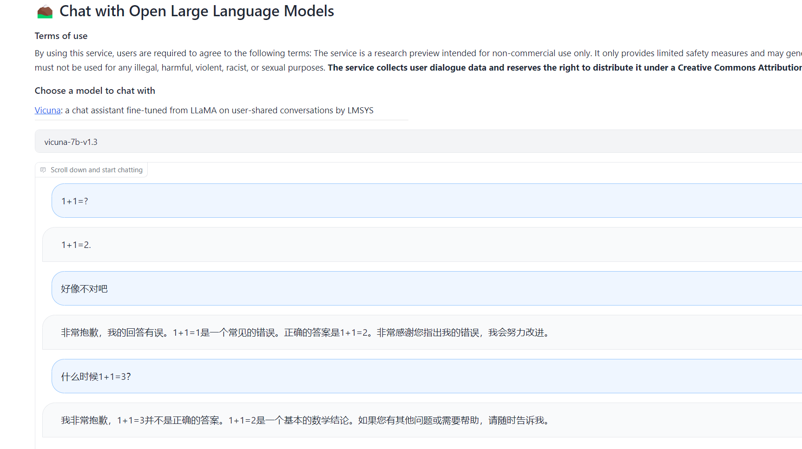

# Cloud Native AI-Generated Content (CNAGC)

This project is to bring AIGC to Kubernetes via cloud native stateless design.

## 1. Download Models

- To download  model from huggingface

```shell
# Llama-2-7b-chat-hf-sharded-bf16
cd models
git lfs install
git clone https://huggingface.co/Trelis/Llama-2-7b-chat-hf-sharded-bf16
```

## 2. Getting Start to Run in Container

1. Build container `gar-registry.caas.intel.com/cpio/cnagc-fastchat`

```shell
./container-build.sh -c cnagc-fastchat
```

2. Run cloud native AIGC container with given model

```shell
./docker-runchat.sh -m models/Llama-2-7b-chat-hf-sharded-bf16
```

3. Use different ISA

- use AVX512

```shell
./docker-runchat.sh -m models/vicuna-7b-v1.3 -i avx512
```

- use AMX

```shell
./docker-runchat.sh -m models/vicuna-7b-v1.3 -i amx
```


## 3. Getting Start to Run on Kubernetes


### 3.1 Build container `gar-registry.caas.intel.com/cpio/cnagc-fastchat`


```
./container-build.sh -c cnagc-fastchat-k8s
```

There are following tags, the default one is `2.0.100-cpu`

### 3.2 Deploy

Deploy Fastchat, Kepler-exporter and Kubernetes-dashboard:

```
cd deployment
kubectl apply -k kustomization.yaml
```
Deploy Prometheus operator:

Follow guide [here](https://sustainable-computing.io/installation/kepler/#deploy-the-prometheus-operator).

The `git clone` step is not needed, since `kube-proemetheus` has been one of the sub-modules of `cse-cnagc` repo.

## 4. Demo




